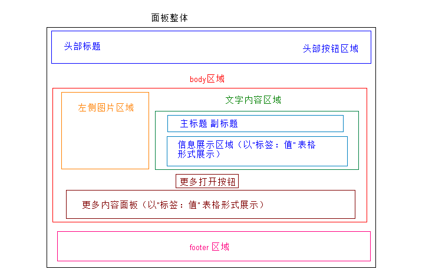

# 面板节点模板工具函数

## 使用场景
扩展gojs 的使用场景，使gojs 节点能够展示更多节点信息

## 安装命令
```sh
npm run widgets go-panel-node
```
执行命令后，工具生成在项目的 **`".my/widgets/go-panel-node"`** 路径下；
有个“panel-node.js”文件， 是面板节点生成的工具函数。

## 面板节点结构


## 面板节点构造函数配置项
```
panelNode({
  panel: {
    // 面板节点全局配置
  },
  header: {
    // 面板头部区域配置
  },
  body: {
    // 主体配置
    image: {
      // 主体左侧图片配置
    },
    info: {
      title: {
        // 主体标题配置 
      },
      detail: {
        // 主体内容配置
      }
    },
    more: {
      // 更多区域内容配置
      detail: {
        // 更多展示内容配置
      }           
    }
  },
  footer: {
    // 面板底部区域配置  
  },

  others: [......], // 其他元素

  // ----继承nodeTemplate 函数的 其他快捷配置项----
  tooltip: {}, // 提示 
  lock: {}, // 锁定
  tags: {}, // 标签
  badge: {}, // 数字提示
  $bindings: [] // 数据绑定
})
```

## 常规使用
:::demo
```html
  <template>
  <Diagram height="400px" :links="[]" :nodes="nodes"  :options="options"></Diagram>
  </template> 
  <script>
  import {   
    go,  
    Diagram,
    templateMap, 
    layered 
  } from '$ui/gojs'
  import creator from '$ui/gojs/utils/creator'
  import {panelNode} from '$ui/widgets/go-panel-node/panel-node'
  import imgSrc from '$ui/gojs/sources/ATM.png'
  export default {
    mixins: [],
    components: {Diagram},
    props: {
    },
    data() {
      return {
        options: {
          layout: layered(),
          nodeTemplateMap: templateMap({ 
            panel: panelNode({
              lock: true,
              // 面板节点整体配置
              panel: { 
                width: 400
              },
              // 面板头部配置
              header: {
                textKey: 'header', 
                font: 'bold 16pt sans-serif' 
              },
              // 面板body配置
              body: {
                // 图片区域
                image: {
                  sourceKey: 'data.img', 
                  width: 100, 
                  stroke: '#B6B7B9'
                },
                // 信息区域配置
                info: {
                  // 信息标题配置
                  title: {
                    titleKey: 'title',
                    subTitleKey: 'data.subTitle' 
                  },
                  // 内容配置
                  detail: {
                    dataKey: 'data.list',
                    column: 3 
                  }
                } 
              } 
            })
          })   
        },
        nodes: [
          {
            key: '1',
            header: '常规面板节点',
            title: '信息内容标题',
            data: {
              subTitle: '(内容副标题)',
              img: imgSrc, 
              list: [
                {label: '标签', value: '内容1'}, 
                {label: '标签', value: '很长很长很长很长很长很长很长很长很长很长的内容', isRow: true}, 
                {label: '标签', value: '内容2'}, 
                {label: '标签', value: '内容3'}, 
                {label: '标签', value: '内容4'}
              ] 
            },
            category: 'panel'
          } 
        ] 
      }
    } 
  }
  </script>
```
:::

## 色彩配置
根据 panel、 info.title、 info.detail 中的背景与字体颜色对面板元素进行颜色的修改配置
:::demo
```html
  <template>
  <Diagram height="400px" :links="[]" :nodes="nodes"  :options="options"></Diagram>
  </template> 
  <script>
  import {   
    go,  
    Diagram,
    templateMap, 
    layered 
  } from '$ui/gojs'
  import creator from '$ui/gojs/utils/creator'
  import {panelNode} from '$ui/widgets/go-panel-node/panel-node'
  import imgSrc from '$ui/gojs/sources/ATM.png'
  export default {
    mixins: [],
    components: {Diagram},
    props: {
    },
    data() {
      return {
        options: {
          layout: layered(),
          nodeTemplateMap: templateMap({ 
            panel: panelNode({
              lock: true,
              // 面板节点整体配置
              panel: { 
                width: 400,
                fill: '#061178' // 面板背景颜色
              },
            
              // 面板body配置
              body: {
                // 图片区域
                image: {
                  sourceKey: 'data.img', 
                  width: 100 
                },
                // 信息区域配置
                info: {
                  title: {
                    titleKey: 'title',
                    subTitleKey: 'data.subTitle',
                    titleProps: {
                      stroke: 'white'  // 标题文字颜色
                    },
                    subTitleProps: {
                      stroke: 'white' // 副标题文字颜色
                    }
                  }, 
                  // 内容配置
                  detail: {
                    dataKey: 'data.list',
                    column: 3,
                    color: 'white' // 内容文字颜色
                  }
                } 
              } 
            })
          })   
        },
        nodes: [
          {
            key: '1',
            header: '常规面板节点',
            title: '信息内容标题',
            data: {
              subTitle: '(内容副标题)',
              img: imgSrc, 
              list: [
                {label: '标签', value: '内容1'}, 
                {label: '标签', value: '很长很长很长很长很长很长很长很长很长很长的内容', isRow: true}, 
                {label: '标签', value: '内容2'}, 
                {label: '标签', value: '内容3'}, 
                {label: '标签', value: '内容4'}
              ] 
            },
            category: 'panel'
          } 
        ] 
      }
    } 
  }
  </script>
```
:::

## Panel节点通用配置
```javascript 
panelNode({          
  panel: { 
    width: 300,
    fill: '#061178', // 面板背景颜色
    sideWidth: 0 // 左侧图片宽度设置为0 
  }
}) 
```

### panelNode的特殊配置参数
| 参数      | 说明    | 类型      | 可选值       | 默认值   |
|---------- |-------- |---------- |-------------  |-------- |
|  width    | 面板节点宽度|  Number | -   |  200   |
|  fill    | 面板节点背景颜色 | String | -  |  white   |
|  sideWidth    | 定义面板内 左侧图片区域宽度 | Number | -  |  80   | 
|  bg    | 定义面板背景图形的参数(go.Shape的配置) | Object | -  |  -   |
|  expandBtn    | 节点树的展开按钮 | Object / Boolean | -  |  -   |
 
> sideWidth 左侧图片宽度 可以在panel的‘sideWidth’中预设置，默认为100。也可以读取 body.image 内的 “width” 来控制图片宽度（取最大值）。 **``如果 sideWidth = 0 且 不配置 body.image， 则不显示图片``**
#### 其他节点配置：
panel支持其他 gojs 中的 graphObject 配置

:::demo
```html
  <template>
  <Diagram height="400px" :links="links" :nodes="nodes"  :options="options"></Diagram>
  </template> 
  <script>
  import {   
    go,  
    Diagram,
    templateMap, 
    layered 
  } from '$ui/gojs'
  import creator from '$ui/gojs/utils/creator'
  import {panelNode} from '$ui/widgets/go-panel-node/panel-node' 
  export default {
    mixins: [],
    components: {Diagram},
    props: {
    },
    data() {
      return {
        options: {
          layout: layered(),
          nodeTemplateMap: templateMap({ 
            panel: panelNode({
              // 面板节点整体配置
              panel: { 
                width: 300,
                fill: 'rgba(7, 18, 122, 0.7)', // '#061178', // 面板背景颜色
                sideWidth: 0, // 左侧图片宽度设置为0, 
                // 其他gojs 的节点配置  
                shadowOffset: new go.Point(14, 14),
                shadowBlur: 20
              }, 
              // 面板body配置
              body: { 
                // 信息区域配置
                info: { 
                  // 内容配置
                  detail: {
                    dataKey: 'data.list',
                    column: 3,
                    color: 'white' // 内容文字颜色
                  }
                } 
              } 
            }),
            bubble: panelNode({
              // 面板节点整体配置
              panel: { 
                width: 300, 
                sideWidth: 0, // 左侧图片宽度设置为0, 
                bg: {
                  figure: 'RoundedRectangle',
                  fill: 'white',
                  strokeWidth: 1,
                  stroke: 'red'
                }
              }, 
              // 面板body配置
              body: { 
                // 信息区域配置
                info: { 
                  // 内容配置
                  detail: {
                    dataKey: 'data.list',
                    column: 3
                    // color: 'white' // 内容文字颜色
                  }
                } 
              } 
            })
          })   
        },
        nodes: [
          {
            key: '1', 
            data: { 
              list: [
                {label: '标签', value: '内容1'}, 
                {label: '标签', value: '很长很长很长很长很长很长很长很长很长很长的内容', isRow: true}, 
                {label: '标签', value: '内容2'}, 
                {label: '标签', value: '内容3'}, 
                {label: '标签', value: '内容4'}
              ] 
            },
            category: 'panel'
          },
          {
            key: '2', 
            data: { 
              list: [
                {label: '标签', value: '内容1'}, 
                {label: '标签', value: '很长很长很长很长很长很长很长很长很长很长的内容', isRow: true}, 
                {label: '标签', value: '内容2'}, 
                {label: '标签', value: '内容3'}, 
                {label: '标签', value: '内容4'}
              ] 
            },
            category: 'bubble'
          }  
        ],
        links: [
          {from: '1', to: '2'}
        ] 
      }
    } 
  }
  </script>
```
:::


## Header 区域配置
```javascript 
panelNode({          
  panel: {...},
  header: {
    textKey: 'header',
    fill: '#030852',
    font: 'bold 16pt sans-serif',
    color: 'white',
    tools: []
  }
}) 
```
### Header的特殊配置参数
| 参数      | 说明    | 类型      | 可选值       | 默认值   |
|---------- |-------- |---------- |-------------  |-------- |
|  textKey    | 面板节点宽度|  Number | -   |  200   |
|  fill    | 面板节点背景颜色 | String | -  |  white   |
|  font    | 定义面板内 左侧图片区域宽度 | Number | -  |  80   | 
|  color   | 头部字体颜色 | Object | -  |  -   | 
|  tools   | 工具按钮列表  | Array | -  |  -   | 
|  tools.icon   | 按钮icon, 为svg path 的字符串  | String | -  |  -   |
|  tools.icon   | 按钮颜色  | String | -  |  -   |
|  tools.cb   | 按钮点击回调函数, 参数为 e, obj(gojs的节点实例)  | Function | -  |  -   | 
|  tools.name   | 按钮名称  | String | -  |  -   |

:::demo

```html
  <template>
  <Diagram height="400px" :links="links" :nodes="nodes"  :options="options"></Diagram>
  </template> 
  <script>
  import {   
    go,  
    Diagram,
    templateMap, 
    layered 
  } from '$ui/gojs'
  import creator from '$ui/gojs/utils/creator'
  import {panelNode} from '$ui/widgets/go-panel-node/panel-node'
  const icons = {
    edit: 'M6 10l2-1 7-7-1-1-7 7-1 2zM4.52 13.548c-0.494-1.043-1.026-1.574-2.069-2.069l1.548-4.262 2-1.217 6-6h-3l-6 6-3 10 10-3 6-6v-3l-6 6-1.217 2z',
    

    delete: 'M2 5v10c0 0.55 0.45 1 1 1h9c0.55 0 1-0.45 1-1v-10h-11zM5 14h-1v-7h1v7zM7 14h-1v-7h1v7zM9 14h-1v-7h1v7zM11 14h-1v-7h1v7z M13.25 2h-3.25v-1.25c0-0.412-0.338-0.75-0.75-0.75h-3.5c-0.412 0-0.75 0.338-0.75 0.75v1.25h-3.25c-0.413 0-0.75 0.337-0.75 0.75v1.25h13v-1.25c0-0.413-0.338-0.75-0.75-0.75zM9 2h-3v-0.987h3v0.987z',

    add: 'M15.5 6h-5.5v-5.5c0-0.276-0.224-0.5-0.5-0.5h-3c-0.276 0-0.5 0.224-0.5 0.5v5.5h-5.5c-0.276 0-0.5 0.224-0.5 0.5v3c0 0.276 0.224 0.5 0.5 0.5h5.5v5.5c0 0.276 0.224 0.5 0.5 0.5h3c0.276 0 0.5-0.224 0.5-0.5v-5.5h5.5c0.276 0 0.5-0.224 0.5-0.5v-3c0-0.276-0.224-0.5-0.5-0.5z'
  }
  export default {
    mixins: [],
    components: {Diagram},
    props: {
    },
    data() {
      return {
        options: {
          layout: layered(),
          nodeTemplateMap: templateMap({ 
            panel: panelNode({
              // 面板节点整体配置
              panel: { 
                width: 300,
                fill: 'rgba(7, 18, 122, 1)', // '#061178', // 面板背景颜色
                sideWidth: 0 // 左侧图片宽度设置为0  
              }, 
              header: {
                textKey: 'header',
                fill: '#030852',
                font: 'bold 16pt sans-serif',
                color: 'white',
                tools: [
                  {
                    icon: icons.delete, 
                    color: 'blue', 
                    cb: this.panelToolClick,
                    name: '删除'
                  },
                  {
                    icon: icons.edit, 
                    color: 'blue', 
                    cb: this.panelToolClick,
                    name: '编辑'
                  },
                  {
                    icon: icons.add, 
                    color: 'blue', 
                    cb: this.panelToolClick,
                    name: '新增'
                  }
                ]
              },
              // 面板body配置
              body: { 
                // 信息区域配置
                info: { 
                  // 内容配置
                  detail: {
                    dataKey: 'data.list',
                    column: 3,
                    color: 'white' // 内容文字颜色
                  }
                } 
              } 
            })
            
          })   
        },
        nodes: [
          {
            key: '1',
            header: '节点header', 
            data: { 
              list: [
                {label: '标签', value: '内容1'}, 
                {label: '标签', value: '很长很长很长很长很长很长很长很长很长很长的内容', isRow: true}, 
                {label: '标签', value: '内容2'}, 
                {label: '标签', value: '内容3'}, 
                {label: '标签', value: '内容4'}
              ] 
            },
            category: 'panel'
          }  
        ],
        links: [] 
      }
    },
    methods: {
      panelToolClick(e, obj) {
        console.log(this, obj.part.location, obj.part.data)
        this.$alert(JSON.stringify(obj.part.data))
      }
    } 
  }
  </script>
```
:::

## Body 区域配置
Body 分为三大模块： image / info / more

## Body.image 图片模块
- body.image 为Body 中的 图片配置项，可以是一个函数（函数为自定义图片）
- body.image 的宽度 以 panel.sideWidth 和 image.width 中的最大值来定义

### image的特殊配置参数
| 参数      | 说明    | 类型      | 可选值       | 默认值   |
|---------- |-------- |---------- |-------------  |-------- |
|  sourceKey   | 对应数据内的图片url字段 | String | -   |  -   |
|  width   | 图片宽度|  Number | -   |  80   |
|  height   | 图片高度|  Number | -   |  -   |
|  stroke   | 边框颜色|  String | -   |  -   |
|  isRight  | 控制图片放右边| Boolean | -   |  200   |

:::demo

```html
<template>
  <Diagram height="400px" :links="links" :nodes="nodes"  :options="options"></Diagram>
  </template> 
  <script>
  import {   
    go,  
    Diagram,
    templateMap, 
    layered 
  } from '$ui/gojs'
  import creator from '$ui/gojs/utils/creator'
  import {panelNode} from '$ui/widgets/go-panel-node/panel-node' 
  import imgSrc from '$ui/gojs/sources/ATM.png'
  export default {
    mixins: [],
    components: {Diagram},
    props: {
    },
    data() {
      return {
        options: {
          layout: layered(),
          nodeTemplateMap: templateMap({ 
            leftImg: panelNode({
              // 面板节点整体配置
              panel: { 
                width: 400,
                fill: '#061178' // 面板背景颜色
              }, 
              // 面板body配置
              body: {
                // 图片区域
                image: {
                  sourceKey: 'data.img', 
                  width: 35,
                  height: 35, 
                  isRight: true 
                },
                // 信息区域配置
                info: {
                  title: {
                    titleKey: 'title',
                    subTitleKey: 'data.subTitle',
                    titleProps: {
                      stroke: 'white'  // 标题文字颜色
                    },
                    subTitleProps: {
                      stroke: 'white' // 副标题文字颜色
                    }
                  }, 
                  // 内容配置
                  detail: {
                    dataKey: 'data.list',
                    column: 3,
                    color: 'white' // 内容文字颜色
                  }
                } 
              } 
            }),
            rightImg: panelNode({
              // 面板节点整体配置
              panel: { 
                width: 400,
                fill: '#061178' // 面板背景颜色
              },
            
              // 面板body配置
              body: {
                // 图片区域
                image: {
                  sourceKey: 'data.img',
                  width: 100
                },
                // 信息区域配置
                info: {
                  title: {
                    titleKey: 'title',
                    subTitleKey: 'data.subTitle',
                    titleProps: {
                      stroke: 'white'  // 标题文字颜色
                    },
                    subTitleProps: {
                      stroke: 'white' // 副标题文字颜色
                    }
                  }, 
                  // 内容配置
                  detail: {
                    dataKey: 'data.list',
                    column: 3,
                    color: 'white' // 内容文字颜色
                  }
                } 
              } 
            })
          })   
        },
        nodes: [
          {
            key: '1', 
            title: '左侧图片节点',
            data: {
              subTitle: '(内容副标题)',
              img: imgSrc, 
              list: [
                {label: '标签', value: '内容1'}, {label: '标签', value: '内容2'},
                {label: '标签', value: '很长很长很长很长很长很长很长很长很长很长的内容', isRow: true} 
              ] 
            },
            category: 'leftImg'
          },
          {
            key: '2', 
            title: '右侧图片节点',
            data: {
              subTitle: '(内容副标题)',
              img: imgSrc, 
              list: [
                {label: '标签', value: '内容1'}, {label: '标签', value: '内容2'},
                {label: '标签', value: '很长很长很长很长很长很长很长很长很长很长的内容', isRow: true},
                
              ] 
            },
            category: 'rightImg'
          }  
        ],
        links: [
          {from: '1', to: '2'}
        ] 
      }
    } 
  }
  </script>
```
:::

## Body.info 内容模块
内容模块分为 “title” 和 “detail” 两个子模块

### Body.info.title

#### 特殊配置参数
| 参数      | 说明    | 类型      | 可选值       | 默认值   |
|---------- |-------- |---------- |-------------  |-------- |
|  titleKey   | 标题对应节点数据的字段 | String | -   |  -   |
|  subTitleKey   | 副标题对应节点数据的字段 |  String | -   |  -   |
|  titleProps   | 标题文字（textBlock）的配置|  Object | -   |  -   |
|  subTitleProps  | 副标题文字（textBlock）的配置|  Object | -   |  -   | 

:::demo

```html
  <template>
  <Diagram height="400px" :links="links" :nodes="nodes"  :options="options"></Diagram>
  </template> 
  <script>
  import {   
    go,  
    Diagram,
    templateMap, 
    layered 
  } from '$ui/gojs'
  import creator from '$ui/gojs/utils/creator'
  import {panelNode} from '$ui/widgets/go-panel-node/panel-node' 
  export default {
    mixins: [],
    components: {Diagram},
    props: {
    },
    data() {
      return {
        options: {
          layout: layered(),
          nodeTemplateMap: templateMap({ 
            onlyTitle: panelNode({
              // 面板节点整体配置
              panel: { 
                width: 300,
                fill: '#f7f3f3a6', // '#061178', // 面板背景颜色
                sideWidth: 0 
              }, 
              // 面板body配置
              body: {
                info: {
                  title: {
                    titleKey: 'title',
                    subTitleKey: 'data.subTitle'
                  } 
                } 
              } 
            }),
            colorTitle: panelNode({
              // 面板节点整体配置
              panel: { 
                width: 300, 
                sideWidth: 0, // 左侧图片宽度设置为0, 
                bg: {
                  figure: 'RoundedRectangle',
                  fill: 'white',
                  strokeWidth: 1,
                  stroke: 'red'
                }
              }, 
              // 面板body配置
              body: { 
                info: {
                  title: {
                    titleKey: 'title',
                    subTitleKey: 'data.subTitle',
                    titleProps: {
                      stroke: '#409eff', 
                      height: 40,
                      font: 'bold 30pt serif',
                      background: 'lightgreen',
                      verticalAlignment: go.Spot.Bottom
                    },
                    subTitleProps: {
                      stroke: '#fd2d18',
                      background: '#f9e603'
                    }
                  }  
                }
                
              } 
            })
          })   
        },
        nodes: [
          {
            key: '1', 
            title: '只有标题节点',
            data: { 
              subTitle: '副标题文字',   
            },
            category: 'onlyTitle'
          },
          {
            key: '2', 
            
            title: '红色主标题',
            data: { 
              subTitle: '蓝色副标题' 
            },
            category: 'colorTitle'
          }  
        ],
        links: [
          // {from: '1', to: '2'}
        ] 
      }
    } 
  }
  </script>
```
:::

### Body.info.detail 
面板节点中显示数据内容的区域。数据以表格布局形式展示。
info 中的detail 可以为函数形式， 支持自定义生成数据显示内容。

#### detail的特殊配置参数
| 参数      | 说明    | 类型      | 可选值       | 默认值   |
|---------- |-------- |---------- |-------------  |-------- |
|  dataKey   | 对应节点数据的内容字段 | String | -   |  -   |
|  column   | 数据展示列数 |  Number | -   |  -   |
|  color   | 内容字体颜色 | String | -   |  -   |
|  contentTemplate | 内容模板函数 | Function | -   |  -   |

#### dataKey 对应数据格式
detail 模块 渲染的 数据必须为一个对象数组，数据格式如下：
- label: [string] 字段数据标题
- value: [string] 字段数据内容
- isRow: [boolean] 是否占满整行 

:::demo 
```html
<template>
  <Diagram height="400px" :links="links" :nodes="nodes"  :options="options"></Diagram>
  </template> 
  <script>
  import {   
    go,  
    Diagram,
    templateMap, 
    layered,
    defaultTooltip 
  } from '$ui/gojs'
  import creator from '$ui/gojs/utils/creator' 
  import {panelNode} from '$ui/widgets/go-panel-node/panel-node' 
  const AddIcon = 'M15.5 6h-5.5v-5.5c0-0.276-0.224-0.5-0.5-0.5h-3c-0.276 0-0.5 0.224-0.5 0.5v5.5h-5.5c-0.276 0-0.5 0.224-0.5 0.5v3c0 0.276 0.224 0.5 0.5 0.5h5.5v5.5c0 0.276 0.224 0.5 0.5 0.5h3c0.276 0 0.5-0.224 0.5-0.5v-5.5h5.5c0.276 0 0.5-0.224 0.5-0.5v-3c0-0.276-0.224-0.5-0.5-0.5z'
  export default {
    mixins: [],
    components: {Diagram},
    props: {
    },
    data() {
      return {
        options: {
          layout: layered(),
          nodeTemplateMap: templateMap({ 
            normal: panelNode({
              // 面板节点整体配置
              panel: { 
                width: 400,
                fill: '#f7f3f3a6', // 面板背景颜色
                sideWidth: 0 
              }, 
              // 面板body配置
              body: {
                info: {
                  title: {
                    titleKey: 'title'
                  },
                  detail: {
                    dataKey: 'data.list',
                    column: 3 
                  }
                } 
              } 
            }),
            normal2: panelNode({
              // 面板节点整体配置
              panel: { 
                width: 300, 
                sideWidth: 0, // 左侧图片宽度设置为0, 
                bg: {
                  figure: 'RoundedRectangle',
                  fill: 'white',
                  strokeWidth: 1,
                  stroke: 'red'
                }
              }, 
              // 面板body配置
              body: { 
                info: {
                  title: {
                    titleKey: 'title'
                  },
                  detail: {
                    dataKey: 'data.list',
                    column: 2,
                    textProps: {
                      toolTip: defaultTooltip({text: 'ttttt'}),
                      overflow: go.TextBlock.OverflowEllipsis,
                      maxLines: 1
                    } 
                  }
                }   
              } 
            }),
            custom: panelNode({
              // 面板节点整体配置
              panel: { 
                width: 400,
                fill: '#f7f3f3', // 面板背景颜色
                sideWidth: 0 
              }, 
              // 面板body配置
              body: {
                info: {
                  title: {
                    titleKey: 'title'
                  },
                  detail: {
                    dataKey: 'data.list',
                    column: 3,
                    contentTemplate: () => {
                      return [ 
                        creator({
                          name: go.Panel,
                          props: {
                            type: go.Panel.Horizontal,
                            defaultAlignment: go.Spot.Center,
                            stretch: go.GraphObject.Fill
                          },
                          children: [
                            creator({
                              name: go.Shape,
                              props: { 
                                fill: 'red',
                                strokeWidth: 0,
                                width: 12,
                                height: 12,
                                margin: 3,
                                geometry: go.Geometry.parse(AddIcon, true)
                              }
                            }),
                            creator({
                              name: go.TextBlock,
                              props: { 
                                font: '14px sans-serif', 
                                stroke: 'blue', 
                                alignment: go.Spot.Top,
                                $bindings: [ 
                                  new go.Binding('text', '', function(i) { 
                                    return i.value
                                  }),
                                  new go.Binding('width', '', function(i) {  
                                    return i._width - 20
                                  })
                                ] 
                              }
                            })
                          ]
                        })  
                      ]
                    } 
                  }
                } 
              } 
            })
          })   
        },
        nodes: [
          {
            key: '1',
            title: '正常字段展示',  
            data: { 
              list: [
                {label: '标签1', value: '字段内容1'}, 
                {label: '标签2', value: '字段内容2'}, 
                {label: '标签3', value: '字段内容3'}, 
                {label: '标签4', value: '字段内容4'}, 
                {label: '标签5', value: '字段内容5'},
                {label: '标签6', value: '字段内容6'},
                {label: '标签7', value: '字段内容7'},
                {label: '标签8', value: '字段内容8'},
              ],   
            },
            category: 'normal'
          },
          {
            key: '2', 
            title: '长字段展示', 
            data: { 
              list: [
                {label: '标签1', value: '字段内容1'}, 
                {label: '标签2', value: '字段内容2'}, 
                {label: '标签3', value: '字段内容3'}, 
                {label: '标签4', value: '很长很长很长字段字段内容4'},
                {label: '', value: '很长很长很长字段内容5', isRow: true}, 
                {label: '', value: '很长很长很长很长很长很长很长很长很长字段内容6', isRow: true}
              ],   
            },
            category: 'normal2'
          }, 
          {
            key: '3',  
            title: '自定义字段展示',
            data: { 
              list: [
                {label: '', value: '字段内容1'}, 
                {label: '', value: '字段内容2'}, 
                {label: '', value: '字段内容3'}, 
                {label: '', value: '字段内容4'} 
              ],   
            },
            category: 'custom'
          }
        ],
        links: [
          // {from: '1', to: '2'}
        ] 
      }
    } 
  }
</script>
```
:::

## Body.more 
描述： more 模块是 body区域中 "info"内容 后面的补充内容区域。
- more 默认提供切换展示按钮，可以切换显示隐藏
- more 区域可以设置为默认显示且不可隐藏，可以用作 节点数据展示的补充布局。

### more的特殊配置参数
| 参数      | 说明    | 类型      | 可选值       | 默认值   |
|---------- |-------- |---------- |-------------  |-------- |
|  hideButton   | 是否显示切换按钮 | Boolean | true/false  |  true   |
|  buttonColor   | 按钮颜色 |  String | -   |  -   |
|  defaultShow   | 区域是否默认显示 | Boolean | -   |  false   |
|  detail | 内容模板配置，同 body.info.detail |  | -   |  -   |

:::demo   
```html
<template>
  <Diagram height="400px" :links="[]" :nodes="nodes"  :options="options"></Diagram>
  </template> 
  <script>
  import {   
    go,  
    Diagram,
    templateMap, 
    layered 
  } from '$ui/gojs'
  import creator from '$ui/gojs/utils/creator'
  import {panelNode} from '$ui/widgets/go-panel-node/panel-node'
  import imgSrc from '$ui/gojs/sources/ATM.png'
   const AddIcon = 'M15.5 6h-5.5v-5.5c0-0.276-0.224-0.5-0.5-0.5h-3c-0.276 0-0.5 0.224-0.5 0.5v5.5h-5.5c-0.276 0-0.5 0.224-0.5 0.5v3c0 0.276 0.224 0.5 0.5 0.5h5.5v5.5c0 0.276 0.224 0.5 0.5 0.5h3c0.276 0 0.5-0.224 0.5-0.5v-5.5h5.5c0.276 0 0.5-0.224 0.5-0.5v-3c0-0.276-0.224-0.5-0.5-0.5z'
  export default {
    mixins: [],
    components: {Diagram},
    props: {
    },
    data() {
      return {
        options: {
          layout: layered(),
          nodeTemplateMap: templateMap({ 
            panel: panelNode({
              // 面板节点整体配置
              panel: { 
                width: 400
              },
              // 面板头部配置
              header: {
                textKey: 'header', 
                font: 'bold 16pt sans-serif' 
              },
              // 面板body配置
              body: {
                // 图片区域
                image: {
                  sourceKey: 'data.img', 
                  width: 100, 
                  stroke: '#B6B7B9'
                },
                // 信息区域配置
                info: {
                  // 信息标题配置
                  title: {
                    titleKey: 'title',
                    subTitleKey: 'data.subTitle' 
                  },
                  // 内容配置
                  detail: {
                    dataKey: 'data.list',
                    column: 3 
                  }
                },
                more: {  
                  defaultShow: false,
                  detail: {
                    dataKey: 'data.other',
                    column: 1
                  } 
                }
              } 
            }),
            frame: panelNode({
              // 面板节点整体配置
              panel: { 
                width: 350,
                bg: {
                  figure: 'RoundedRectangle',
                  fill: 'white',
                  strokeWidth: 1,
                  stroke: 'red'
                }
              },
               
              // 面板body配置
              body: {
                // 图片区域
                image: {
                  sourceKey: 'data.img',
                  isRight: true, 
                  width: 60, 
                  stroke: '#B6B7B9'
                },
                // 信息区域配置
                info: {
                  // 信息标题配置
                  title: {
                    titleKey: 'title'  
                  },
                  // 内容配置
                  detail: {
                    dataKey: 'data.list',
                    column: 2 
                  }
                },
                more: { 
                  hideButton: true, 
                  defaultShow: true,
                  detail: {
                    dataKey: 'data.other',
                    column: 2
                  } 
                }
              } 
            }), 
            customMore: panelNode({
              // 面板节点整体配置
              panel: { 
                width: 350,
                bg: {
                  figure: 'RoundedRectangle',
                  fill: 'skyblue',
                  strokeWidth: 2,
                  stroke: 'yellow'
                }
              },
               
              // 面板body配置
              body: {  
                // 信息区域配置
                info: {
                  // 信息标题配置
                  title: {
                    titleKey: 'title'  
                  },
                  // 内容配置
                  detail: {
                    dataKey: 'data.list',
                    column: 2 
                  }
                },
                more: {  
                  defaultShow: true,
                  detail: () => {
                    return creator({
                      name: go.Shape,
                      props: {
                        fill: 'green',
                        strokeWidth: 0,
                        width: 38,
                        height: 38,
                        margin: 3,
                        alignment: go.Spot.Center,
                        geometry: go.Geometry.parse(AddIcon, true)
                      }
                    })
                  } 
                }
              } 
            })
          })   
        },
        nodes: [
          {
            key: '1',
            header: '常规面板节点',
            title: '可切换more内容',
            data: {
              subTitle: '(内容副标题)',
              img: imgSrc, 
              list: [
                {label: '标签', value: '内容1'}, 
                {label: '标签', value: '很长很长很长很长很长很长很长很长很长很长的内容', isRow: true}, 
                {label: '标签', value: '内容2'}, 
                {label: '标签', value: '内容3'}, 
                {label: '标签', value: '内容4'}
              ],
              other: [
                {
                  label: '', 
                  value: '很长很长很长很长很长很，长很长很长很长很长的内容, 很长很长很长很长很长很长很长很长很长很长的内容'
                },
                {
                  label: '', 
                  value: '内容，非常非常非常非常非常, 非常非常非常非常非常多' 
                }
              ]
            },
            category: 'panel'
          },
          {
            key: '2',
            header: '',
            title: 'more区域用于补充布局',
            data: {
              subTitle: '',
              img: imgSrc, 
              list: [
                {label: '标签', value: '内容1'},  
                {label: '标签', value: '内容2'}, 
                {label: '标签', value: '内容3'}, 
                {label: '标签', value: '内容4'}
              ],
              other: [
                {
                  label: '', 
                  value: '1.很长很长很长很长很长很长很长很长很长很长的内容, 很长很长很长很长很长很长很长很长很长很长的内容',
                  isRow: true
                },
                {
                  label: '', 
                  value: '2.内容，非常非常非常非常非常非常非常非常非常非常多',
                  isRow: true
                }
              ]
            },
            category: 'frame'
          },
          {
            key: '3',
            header: '',
            title: 'more区域自定义内容',
            data: {
              subTitle: '',
              img: '', 
              list: [
                {label: '标签', value: '内容1'},  
                {label: '标签', value: '内容2'}, 
                {label: '标签', value: '内容3'}, 
                {label: '标签', value: '内容4'}
              ],
              other: []
            },
            category: 'customMore'
          }    
        ] 
      }
    } 
  }
  </script>
```
:::

## Footer区域配置
Footer 是 配置面板底部的GraphObject 的配置参数，在Body区域外面。 
### Footer 配置参数
Footer的参数比较简单，只保留了 fill (背景颜色) 和 content(内容渲染函数) 两个。这是为了尽可能保留 底部内容 的自由度
> 主要是开发者累了，不想写了。还是你们自己来吧。

| 参数      | 说明    | 类型      | 可选值       | 默认值   |
|---------- |-------- |---------- |-------------  |-------- |
|  fill   | 底部背景颜色 | String | -  |  -   |
|  content  | 内容生成函数 | Function | -  |  -   | 
> content 内容生成函数 需要返回一个gojs的 GraphObject 实例 （例如 go.Panel 或 go.Shape ）

:::demo
```html
<template>
  <Diagram height="400px" :links="[]" :nodes="nodes"  :options="options"></Diagram>
  </template> 
  <script>
  import {   
    go,  
    Diagram,
    templateMap, 
    layered 
  } from '$ui/gojs'
  import creator from '$ui/gojs/utils/creator'
  import {panelNode} from '$ui/widgets/go-panel-node/panel-node'
  import imgSrc from '$ui/gojs/sources/ATM.png'
  export default {
    mixins: [],
    components: {Diagram},
    props: {
    },
    data() {
      return {
        options: {
          layout: layered(),
          nodeTemplateMap: templateMap({ 
            panel: panelNode({
              // 面板节点整体配置
              panel: { 
                width: 400
              },
              // 面板头部配置
              header: {
                textKey: 'header', 
                font: 'bold 16pt sans-serif' 
              },
              // 面板body配置
              body: {
                // 图片区域
                image: {
                  sourceKey: 'data.img', 
                  width: 100, 
                  stroke: '#B6B7B9'
                },
                // 信息区域配置
                info: {
                  // 信息标题配置
                  title: {
                    titleKey: 'title',
                    titleProps: {
                      $bindings: [
                        new go.Binding('text', '', (v) => { 
                          return v.confirm ? '节点已确认' : '未确认节点'
                        }),
                        new go.Binding('stroke', '', (v) => { 
                          return v.confirm ? 'red' : 'black'
                        })
                      ]
                    },
                    subTitleKey: 'data.subTitle' 
                  },
                  // 内容配置
                  detail: {
                    dataKey: 'data.list',
                    column: 3 
                  }
                } 
              },
              footer: {
                // fill: 'pink',
                content: () => {
                  return creator({
                    name: go.Panel,
                    props: {
                      type: go.Panel.Table,
                      row: 0, 
                      columnSpan: 1,
                      stretch: go.GraphObject.Horizontal 
                      // alignment: go.Spot.Left 
                      // margin: 5
                    },
                    children: [
                      creator({
                        name: go.Panel,
                        props: {
                          type: go.Panel.Horizontal,
                          row: 0, 
                          column: 1,
                          alignment: go.Spot.Right  
                        },
                        children: [
                          creator({
                            name: 'Button',
                            props: { 
                              margin: 3,
                              width: 60,
                              height: 28,
                              $events: {
                                click: this.footerBtnClick
                              }
                            },
                            children: [
                              creator({
                                name: 'TextBlock',
                                props: {
                                  text: '确定'
                                }
                              })  
                            ]
                          })
                        ]
                      })
                    ]
                  }) 
                }
              } 
            })
          })   
        },
        nodes: [
          {
            key: '1',
            header: '有footer的节点',
            title: '',
            confirm: false,
            data: {
              subTitle: '(内容副标题)',
              img: imgSrc, 
              list: [
                {label: '标签', value: '内容1'}, 
                {label: '标签', value: '很长很长很长很长很长很长很长很长很长很长的内容', isRow: true}, 
                {label: '标签', value: '内容2'}, 
                {label: '标签', value: '内容3'}, 
                {label: '标签', value: '内容4'}
              ] 
            },
            category: 'panel'
          } 
        ] 
      }
    },
    methods: {
      footerBtnClick(e, obj) {
        const node = obj.part;
        const data = node.data
        node.diagram.model.commit((m) => {
          m.set(data, 'confirm', !data.confirm);
        }, 'clicked') 
      }
    } 
  }
  </script>
```
:::

## 其他额外功能
### panel.expandBtn 树拓展按钮
在 panel配置（面板的全局配置）下有一个 “expandBtn”的 配置，支持 Object 和 Boolean 类型。 用于控制 节点是否显示 树展开按钮

#### TreeExpandButton 的参数：
```javascript
{
  // set the two additional properties used by "TreeExpanderButton"
  // that control the shape depending on the value of Node.isTreeExpanded
  "_treeExpandedFigure": "TriangleUp",
  "_treeCollapsedFigure": "TriangleDown",
  // set properties on the icon within the border
  "ButtonIcon.fill": "darkcyan",
  "ButtonIcon.strokeWidth": 0,
  // set general "Button" properties
  "ButtonBorder.figure": "Circle",
  "ButtonBorder.stroke": "darkcyan",
  "_buttonStrokeOver": "darkcyan",
  alignment: go.Spot.Bottom, 
  alignmentFocus: go.Spot.Top
}
```

:::demo
```html
<template>
<Diagram height="400px" :links="links" :nodes="nodes"  :options="options"></Diagram>
</template> 
<script>
import {   
  go,  
  Diagram,
  templateMap, 
  layered 
} from '$ui/gojs'
import creator from '$ui/gojs/utils/creator'
import {panelNode} from '$ui/widgets/go-panel-node/panel-node' 
export default {
  mixins: [],
  components: {Diagram},
  props: {
  },
  data() {
    return {
      options: {
        layout: layered(),
        nodeTemplateMap: templateMap({ 
          panel: panelNode({
            // 面板节点整体配置
            panel: { 
              width: 300,
              fill: 'rgba(7, 18, 122, 0.7)', // '#061178', // 面板背景颜色
              sideWidth: 0, // 左侧图片宽度设置为0, 
              // 其他gojs 的节点配置  
              shadowOffset: new go.Point(14, 14),
              shadowBlur: 20, 
              expandBtn: {}
            }, 
            // 面板body配置
            body: { 
              // 信息区域配置
              info: { 
                // 内容配置
                detail: {
                  dataKey: 'data.list',
                  column: 3,
                  color: 'white' // 内容文字颜色
                }
              } 
            } 
          }),
          bubble: panelNode({
            // 面板节点整体配置
            panel: { 
              width: 300, 
              sideWidth: 0, // 左侧图片宽度设置为0, 
              bg: {
                figure: 'RoundedRectangle',
                fill: 'white',
                strokeWidth: 1,
                stroke: 'red'
              }, 
              expandBtn: {
                // 树扩展按钮的定位配置
                // alignment: new go.Spot(1, 0.5), 
                // alignmentFocus: go.Spot.Left
              }
            }, 
            // 面板body配置
            body: { 
              // 信息区域配置
              info: { 
                // 内容配置
                detail: {
                  dataKey: 'data.list',
                  column: 3
                  // color: 'white' // 内容文字颜色
                }
              } 
            } 
          })
        })   
      },
      nodes: [
        {
          key: '1', 
          data: { 
            list: [
              {label: '标签', value: '内容1'}, 
              {label: '标签', value: '很长很长很长很长很长很长很长很长很长很长的内容', isRow: true}, 
              {label: '标签', value: '内容2'}, 
              {label: '标签', value: '内容3'}, 
              {label: '标签', value: '内容4'}
            ] 
          },
          category: 'panel'
        },
        {
          key: '2', 
          data: { 
            list: [
              {label: '标签', value: '内容1'}, 
              {label: '标签', value: '很长很长很长很长很长很长很长很长很长很长的内容', isRow: true}, 
              {label: '标签', value: '内容2'}, 
              {label: '标签', value: '内容3'}, 
              {label: '标签', value: '内容4'}
            ] 
          },
          category: 'bubble'
        }  
      ],
      links: [
        {from: '1', to: '2'}
      ] 
    }
  } 
}
</script>
```
:::

### Others
Others 是个数组，里面元素为gojs 的 graphObject

:::demo
```html
<template>
<Diagram height="400px" :links="links" :nodes="nodes"  :options="options"></Diagram>
</template> 
<script>
import {   
  go,  
  Diagram,
  templateMap, 
  layered 
} from '$ui/gojs'
import creator from '$ui/gojs/utils/creator'
import {panelNode} from '$ui/widgets/go-panel-node/panel-node' 
const AddIcon = 'M15.5 6h-5.5v-5.5c0-0.276-0.224-0.5-0.5-0.5h-3c-0.276 0-0.5 0.224-0.5 0.5v5.5h-5.5c-0.276 0-0.5 0.224-0.5 0.5v3c0 0.276 0.224 0.5 0.5 0.5h5.5v5.5c0 0.276 0.224 0.5 0.5 0.5h3c0.276 0 0.5-0.224 0.5-0.5v-5.5h5.5c0.276 0 0.5-0.224 0.5-0.5v-3c0-0.276-0.224-0.5-0.5-0.5z'
 
export default {
  mixins: [],
  components: {Diagram},
  props: {
  },
  data() {
    return {
      options: {
        layout: layered(),
        nodeTemplateMap: templateMap({ 
          bubble: panelNode({
            // 面板节点整体配置
            panel: { 
              width: 300, 
              sideWidth: 0, // 左侧图片宽度设置为0, 
              bg: {
                figure: 'RoundedRectangle',
                fill: 'white',
                strokeWidth: 1,
                stroke: 'red'
              } 
            }, 
            // 面板body配置
            body: { 
              // 信息区域配置
              info: { 
                // 内容配置
                detail: {
                  dataKey: 'data.list',
                  column: 3 
                }
              } 
            },
            others: [
              creator({
                name: go.Shape,
                props: {
                  fill: 'green',
                  strokeWidth: 0,
                  width: 38,
                  height: 38,
                  margin: 3, 
                  geometry: go.Geometry.parse(AddIcon, true),
                  alignment: new go.Spot(0.95, 0.15), 
                  alignmentFocus: go.Spot.BottomLeft
                }
              })
            ] 
          })
        })   
      },
      nodes: [
        
        {
          key: '2', 
          data: { 
            list: [
              {label: '标签', value: '内容1'}, 
              {label: '标签', value: '很长很长很长很长很长很长很长很长很长很长的内容', isRow: true}, 
              {label: '标签', value: '内容2'}, 
              {label: '标签', value: '内容3'}, 
              {label: '标签', value: '内容4'}
            ] 
          },
          category: 'bubble'
        }  
      ],
      links: [ 
      ] 
    }
  } 
}
</script>
```
:::

### tooltip lock tags badge $bindings
panelNode() 方法是基于 nodeTemplate() 函数生成的节点模板，因此 支持 以上几个 快捷配置参数
> "nodeTemplate()" 为 "import {nodeTemplate} from '$ui/gojs/template/nodes'", 是 myGo 组件中默认的节点模板构造函数。


:::demo
```html
<template>
  <Diagram height="400px" :links="[]" :nodes="nodes"  :options="options"></Diagram>
</template> 
<script>
  import {
    go,   
    Diagram,
    // templateMap, 
    layered 
  } from '$ui/gojs' 
  import {panelNode} from '$ui/widgets/go-panel-node/panel-node'
  import imgSrc from '$ui/gojs/sources/ATM.png'
  export default {
    mixins: [],
    components: {Diagram},
    props: {
    },
    data() {
      return {
        options: {
          layout: layered(),
          nodeTemplate: panelNode({
            
            // ==========面板的常规配置===============  
            // 面板节点整体配置
            panel: { 
              width: 400
            },
            // 面板头部配置
            header: {
              textKey: 'header', 
              font: 'bold 16pt sans-serif' 
            },
            // 面板body配置
            body: {
              // 图片区域
              image: {
                sourceKey: 'data.img', 
                width: 100, 
                stroke: '#B6B7B9'
              },
              // 信息区域配置
              info: {
                // 信息标题配置
                title: {
                  titleKey: 'title',
                  subTitleKey: 'data.subTitle' 
                },
                // 内容配置
                detail: {
                  dataKey: 'data.list',
                  column: 3 
                }
              } 
            },

            // ======以下是 nodeTemplate 的自身的快捷配置======
            // 全局锁定
            lock: {
              width: 20,
              height: 20,
              alignment: new go.Spot(0.95, 0.15), 
              alignmentFocus: go.Spot.BottomLeft
            },
            // 全局节点 badge 
            badge: {
              props: {
                alignment: new go.Spot(0, 0), 
                alignmentFocus: go.Spot.BottomLeft
              },
              label: {
                $bindings: [
                  new go.Binding('text', 'count'),
                  new go.Binding('visible', 'count', v => v > 0)
                ]
              }
            },
            // 全局节点tooltip提示
            tooltip: {
              // text: '鼠标经过提示文本'
              $bindings: [
                new go.Binding('text', 'title')
              ]
            },
            // 全局节点数据绑定
            $bindings: [ 
              new go.Binding('movable', 'locked', v => !v)
            ]
          })
        },
        nodes: [
          {
            key: '1',
            locked: true,
            count: 10,
            header: '常规面板节点',
            title: '被锁定的面板节点',
            data: {
              subTitle: '(内容副标题)',
              img: imgSrc, 
              list: [
                {label: '标签', value: '内容1'}, 
                {label: '标签', value: '很长很长很长很长很长很长很长很长很长很长的内容', isRow: true}, 
                {label: '标签', value: '内容2'}, 
                {label: '标签', value: '内容3'}, 
                {label: '标签', value: '内容4'}
              ] 
            },
            category: 'panel'
          } 
        ] 
      }
    } 
  }
</script>
```
:::

## 使用案例
侦查组织结构图例：
:::demo
```html
<template>
  <Diagram height="400px" :links="links" :nodes="nodes"  :options="options"></Diagram>
</template> 
<script>
  import {
    go,   
    Diagram,
    templateMap, 
    tree,
    corner
  } from '$ui/gojs' 
  import creator from '$ui/gojs/utils/creator'
  import {panelNode} from '$ui/widgets/go-panel-node/panel-node'
  import imgSrc from '$ui/gojs/sources/QQ群1.png'
  const icons = {
    edit: 'M6 10l2-1 7-7-1-1-7 7-1 2zM4.52 13.548c-0.494-1.043-1.026-1.574-2.069-2.069l1.548-4.262 2-1.217 6-6h-3l-6 6-3 10 10-3 6-6v-3l-6 6-1.217 2z', 
    add: 'M15.5 6h-5.5v-5.5c0-0.276-0.224-0.5-0.5-0.5h-3c-0.276 0-0.5 0.224-0.5 0.5v5.5h-5.5c-0.276 0-0.5 0.224-0.5 0.5v3c0 0.276 0.224 0.5 0.5 0.5h5.5v5.5c0 0.276 0.224 0.5 0.5 0.5h3c0.276 0 0.5-0.224 0.5-0.5v-5.5h5.5c0.276 0 0.5-0.224 0.5-0.5v-3c0-0.276-0.224-0.5-0.5-0.5z'
  }
  export default {
    mixins: [],
    components: {Diagram},
    props: {
    },
    data() {
      return {
        options: {
          layout: tree(),
          linkTemplate: corner({}),
          nodeTemplateMap: templateMap({
            group: panelNode({ 
              // ==========面板的常规配置===============  
              // 面板节点整体配置
              panel: { 
                width: 430
              },
              // 面板头部配置
              header: {
                textKey: 'header', 
                font: 'bold 14pt sans-serif',
                tools: [ 
                  {
                    icon: icons.edit, 
                    color: 'red', 
                    cb: this.panelToolClick,
                    name: '编辑专案组'
                  },
                  {
                    icon: icons.add, 
                    color: 'red', 
                    cb: this.addTeamClick,
                    name: '新增专案小组'
                  } 
                ]
              },
              // 面板body配置
              body: {
                // 图片区域
                image: {
                  sourceKey: 'data.img', 
                  width: 80, 
                  height: 80,
                  stroke: '#B6B7B9'
                },
                // 信息区域配置
                info: {
                  // 信息标题配置
                  title: {
                    titleKey: 'title'
                    // subTitleKey: 'data.subTitle' 
                  },
                  // 内容配置
                  detail: {
                    dataKey: 'data.list',
                    column: 2 
                  }
                }, 
                more: {  
                  defaultShow: false,
                  detail: {
                    dataKey: 'data.other',
                    column: 1
                  } 
                }
              }
            }),
            team: panelNode({
              panel: { 
                width: 250,
                sideWidth: 0,
                bg: {
                  figure: 'RoundedRectangle',
                  fill: 'white',
                  strokeWidth: 1,
                  stroke: 'red'
                }
              },
              body: { 
                // 信息区域配置
                info: {
                  // 信息标题配置
                  title: {
                    titleKey: 'title',
                    titleProps: {
                      font: 'normal 12pt sans-serif'
                    } 
                  },
                  // 内容配置
                  detail: {
                    dataKey: 'data.list',
                    column: 3,
                    contentTemplate: this.memberTextTemplate 
                  }
                } 
              }
            }) 
          })
          
        },
        nodes: [
          {
            key: '1', 
            header: '专案组',
            title: '陈戌元滥用职权案',
            data: {
              subTitle: '',
              img: imgSrc, 
              list: [
                {label: '立案日期', value: '2022-02-01'},  
                {label: '立案单位', value: '中央纪委'}, 
                {label: '专案组长', value: '范智毅'}, 
                {label: '专案组人数', value: 30}
              ],
              other: [
                {label: '案件简要', value: '中X纪委于2022年2月1日即大年初一晚上10点，中国男子足球队1：3客场负于越南队后，接到匿名举报信举报中国足协主席陈戌元滥用职权，并控制国内球员转会市场操作从中牟利......'}
              ]  
            },
            category: 'group'
          },
          {
            key: '2', 
            header: '',
            title: '银行查账组',
            data: {
              subTitle: '',
              img: '', 
              list: [
                {label: '', value: '调查员1'},  
                {label: '', value: '调查员2'}, 
                {label: '', value: '调查员3'}, 
                {label: '', value: '调查员4'}
              ] 
            },
            category: 'team'
          },
          {
            key: '3', 
            header: '',
            title: '足协文件搜查组',
            data: {
              subTitle: '',
              img: '', 
              list: [
                {label: '', value: '调查员1'},  
                {label: '', value: '调查员2'}, 
                {label: '', value: '调查员3'}, 
                {label: '', value: '调查员4'}
              ] 
            },
            category: 'team'
          },
          {
            key: '4', 
            header: '',
            title: '俱乐部欠薪追查组',
            data: {
              subTitle: '',
              img: '', 
              list: [
                {label: '', value: '调查员1'},  
                {label: '', value: '调查员2'}, 
                {label: '', value: '调查员3'}, 
                {label: '', value: '调查员4'}
              ] 
            },
            category: 'team'
          },
          {
            key: '5', 
            header: '',
            title: '球员调查组',
            data: {
              subTitle: '',
              img: '', 
              list: [
                {label: '', value: '调查员1'},  
                {label: '', value: '调查员2'}, 
                {label: '', value: '调查员3'}, 
                {label: '', value: '调查员4'}
              ] 
            },
            category: 'team'
          }
        ],
        links: [
          {from: '1', to: '2'},
          {from: '1', to: '3'},
          {from: '1', to: '4'},
          {from: '1', to: '5'}
        ]

      }
    },
    methods: {
      memberTextTemplate() {
        return [ 
          creator({
            name: go.Panel,
            props: {
              type: go.Panel.Horizontal,
              defaultAlignment: go.Spot.Center,
              stretch: go.GraphObject.Fill
            },
            children: [
              creator({
                name: go.TextBlock,
                props: { 
                  background: 'red',
                  stroke: 'white',
                  width: 16,
                  height: 16,
                  margin: 3,
                  alignment: go.Spot.Center,
                  textAlign: 'center',
                  $bindings: [ 
                    new go.Binding('text', '', (i) => {
                      return i._index + 1
                    })
                  ]
                }
              }),
              creator({
                name: go.TextBlock,
                props: { 
                  font: '14px sans-serif', 
                  stroke: 'blue', 
                  alignment: go.Spot.Center,
                  $bindings: [ 
                    new go.Binding('text', '', function(i) { 
                      return i.value
                    }),
                    new go.Binding('width', '', function(i) {  
                      return i._width - 20
                    })
                  ] 
                }
              })
            ]
          })  
        ]
      },
      panelToolClick(e, obj) {
        console.log(this, obj.part.location, obj.part.data)
        this.$alert(JSON.stringify(obj.part.data))
      },
      addTeamClick() {
        this.$alert('添加调查小组')
      }
    } 
  }
</script>
```
:::


## panel-node.js 源码

:::demo
```javascript
// import { $ } from '$ui/gojs'
import get from 'lodash/get'
import {go, merge} from '$ui/gojs/utils/lib';
import creator from '$ui/gojs/utils/creator'
import {nodeTemplate} from '$ui/gojs/template/nodes'
import {defaultTooltip} from '$ui/gojs/template/common'
import {normal} from '$ui/gojs/template/theme'

const MoreBtnSvgDown = 'M992.01127 416.3c-7.4 0-14.9 2.6-20.9 7.8l-417 360.8c-24 21-60.3 21-84.3 0l-0.1-0.1L52.91127 424.1c-13.4-11.6-33.6-10.1-45.1 3.3-11.6 13.4-10.1 33.6 3.3 45.1l416.7 360.6c23.3 20.4 53.2 31.6 84.2 31.6s60.9-11.2 84.2-31.6l416.7-360.6c13.4-11.6 14.8-31.8 3.3-45.1-6.3-7.4-15.2-11.1-24.2-11.1zM992.01127 159.3c-7.4 0-14.9 2.6-20.9 7.8l-417 360.8c-24 21-60.3 21-84.3 0l-0.1-0.1L52.91127 167.1c-13.4-11.6-33.6-10.1-45.1 3.3-11.6 13.4-10.1 33.6 3.3 45.1l416.7 360.6c23.3 20.4 53.2 31.6 84.2 31.6s60.9-11.2 84.2-31.6l416.7-360.6c13.4-11.6 14.8-31.8 3.3-45.1-6.3-7.4-15.2-11.1-24.2-11.1z'

const MoreBtnSvgUp = 'M992.01127 607.7c-7.4 0-14.9-2.6-20.9-7.8l-417-360.8c-24-21-60.3-21-84.3 0l-0.1 0.1L52.91127 599.9c-13.4 11.6-33.6 10.1-45.1-3.3-11.6-13.4-10.1-33.6 3.3-45.1l416.7-360.6c23.3-20.4 53.2-31.6 84.2-31.6s60.9 11.2 84.2 31.6l416.7 360.6c13.4 11.6 14.8 31.8 3.3 45.1-6.3 7.4-15.2 11.1-24.2 11.1zM992.01127 864.7c-7.4 0-14.9-2.6-20.9-7.8l-417-360.8c-24-21-60.3-21-84.3 0l-0.1 0.1L52.91127 856.9c-13.4 11.6-33.6 10.1-45.1-3.3-11.6-13.4-10.1-33.6 3.3-45.1l416.7-360.6c23.3-20.4 53.2-31.6 84.2-31.6s60.9 11.2 84.2 31.6l416.7 360.6c13.4 11.6 14.8 31.8 3.3 45.1-6.3 7.4-15.2 11.1-24.2 11.1z'


const defaultPanelProps = {
  isShadowed: true,
  shadowOffset: new go.Point(4, 4),
  shadowBlur: 8,
  width: 250
}

// 头部生成
const headerPanelInit = function(headerProps) { 
  const headerFill = headerProps.fill || '#E8E8E8'
  const headerFont = headerProps.font || 'bold 12pt sans-serif'
  const headerFontStroke = headerProps.color || 'black'
  const textKey = headerProps.textKey
  const headerTools = headerProps.tools
  return creator({
    name: go.Panel,
    props: {
      type: go.Panel.Auto,
      row: 0, 
      column: 0, 
      stretch: go.GraphObject.Horizontal 
    },
    children: [
      creator({
        name: go.Shape,
        props: {
          fill: headerFill, // '#E8E8E8', 
          strokeWidth: 0, 
          shadowVisible: false
        },
        children: []
      }),
      creator({
        name: go.Panel,
        props: {
          type: go.Panel.Table,
          row: 0, 
          columnSpan: 1,
          stretch: go.GraphObject.Horizontal 
          // alignment: go.Spot.Left 
          // margin: 5
        },
        children: [ 
          creator({
            name: go.TextBlock,
            props: {
              row: 0, 
              column: 0,
              font: headerFont, // 'bold 12pt sans-serif',
              alignment: go.Spot.TopLeft,
              margin: 5,
              stroke: headerFontStroke,
              isMultiline: false,
              editable: false,
              $bindings: [
                new go.Binding('text', '', (v) => {
                  const val = get(v, textKey) 
                  return val || ''
                })
              ]
            } 
          }),
          headerTools && headerTools.length ? creator({
            name: go.Panel,
            props: {
              type: go.Panel.Horizontal,
              row: 0, 
              column: 1,
              alignment: go.Spot.Right  
            },
            children: [
              ...headerTools.map((item) => { 
                return creator({
                  name: 'Button',
                  props: { 
                    margin: 3, 
                    'ButtonBorder.fill': 'transparent',
                    'ButtonBorder.stroke': 'transparent',
                    'ButtonBorder.strokeWidth': 0,
                    _buttonFillOver: 'transparent',
                    _buttonStrokeOver: 'transparent',
                    _buttonFillPressed: 'transparent', 
                    toolTip: defaultTooltip({text: item.name}),
                    $events: {
                      click: item.cb 
                    }
                  },
                  children: [  
                    creator({
                      name: go.Shape,
                      props: {
                        fill: item.color,
                        strokeWidth: 0,
                        width: 18,
                        height: 18,
                        geometry: go.Geometry.parse(item.icon, true)
                      }
                    })
                  ]
                })
              })
            ]
          }) : null
        ]
      }) 
    ]
  })
} 


/**
 * 生成图片
 * @param options options 配置参数，{shape, label, image}
 * @param theme
 * @returns {GraphObject}
 */
function imageGraph(options = {}, theme = {}) {
  const t = merge({}, normal, theme)
  const {shape, image} = options 
  let {width = 64, height = 64} = shape || {}
  const {figure = 'Circle'} = shape || {}
  const iWidth = image.width || 64
  const iHeight = image.height || 64
  width = iWidth // Math.max(width, iWidth)
  height = iHeight // Math.max(height, iHeight)
  return creator({
    name: go.Panel,
    props: {
      type: go.Panel.Spot 
    },
    children: [
      creator({
        name: go.Shape,
        props: {
          figure,
          width: width,
          height: height, 
          fill: 'transparent',
          strokeWidth: 0, 
          ...shape
        }
      }), 
      creator({
        name: go.Panel,
        props: {
          type: go.Panel.Spot,
          isClipping: true
        },
        children: [
          creator({
            name: go.Shape,
            props: {
              figure,
              width,
              height, 
              ...shape
            }
          }),
          creator({
            name: go.Picture,
            props: {
              name: 'image',
              source: t.imageSource,
              width,
              height,
              ...image
            }
          }) 
        ]
      })
    ]
  })
}

// 图片生成
export const imageGraphInit = function(imgProps) {
  if (!imgProps) return null
  if (typeof imgProps === 'function') {
    imgProps()
  } else {
    const sourceKey = imgProps.sourceKey
    const stroke = imgProps.stroke 
    delete imgProps.sourceKey
    delete imgProps.stroke
    delete imgProps.isRight
    return imageGraph({
      image: { 
        width: 80,
        $bindings: [
          new go.Binding('source', '', (v) => { 
            const val = get(v, sourceKey)
            return val
          })
        ], 
        ...imgProps
      },
      shape: {
        figure: 'Rectangle',
        strokeWidth: 1,
        stroke: stroke || '#B6B7B9'
      }
    })
  }
}

// 标题生成
const titleBlockInit = function(titleProps) {
  if (typeof titleProps === 'function') {
    return titleProps()
  } else {
    return creator({
      name: go.Panel,
      props: {
        type: go.Panel.Auto
      },
      children: [ 
        creator({
          name: go.Panel,
          props: {
            type: go.Panel.Horizontal,
            defaultAlignment: go.Spot.Bottom
          },
          children: [
            titleProps.titleKey ? creator({
              name: go.TextBlock,
              props: {
                font: 'bold 16pt sans-serif',
                isMultiline: false, 
                $bindings: [
                  new go.Binding('text', '', (v) => { 
                    const val = get(v, titleProps.titleKey)
                    return val
                  })
                ],
                ...titleProps.titleProps || {} 
              } 
            }) : null, 
            titleProps.subTitleKey ? creator({
              name: go.TextBlock,
              props: {
                font: 'normal 12pt sans-serif',
                isMultiline: false,
                editable: false,
                margin: new go.Margin(0, 0, 2, 10),
                $bindings: [
                  new go.Binding('text', '', (v) => { 
                    const val = get(v, titleProps.subTitleKey)
                    return val
                  })
                ],
                ...titleProps.subTitleProps || {} 
              } 
            }) : null
          ]
        })
      ]
    }) 
  }
  
}

// 内容生成
export const detailInit = function(infoProps) {
  const {detail} = infoProps
  const infoWidth = infoProps.width 
  if (!detail) return null
  if (typeof detail === 'function') {
    return detail()
  } else { 
    const dataKey = detail.dataKey
    const column = detail.column
    const strokeColor = detail.color 
    const contentTemplate = detail.contentTemplate
    return creator({
      name: go.Panel,
      props: {
        name: 'detail',
        type: go.Panel.Table, 
        width: infoWidth,
        // defaultAlignment: go.Spot.Top,
        $bindings: [
          new go.Binding('itemArray', '', (v) => { 
            const data = get(v, dataKey)
            // =============下面代码为建立数据的表格格式================
            const temp = JSON.parse(JSON.stringify(data)).reduce((total, item) => {
              if (item.isRow) {
                total.row.push(item)
              } else {
                total.normal.push(item)
              }
              return total
            }, {normal: [], row: []})

            let currentRow = 0
            temp.normal.forEach((item, i) => {
              currentRow = item._row = Math.floor(i / column)
              item._col = i % column
              
              item._width = (infoWidth / column) - 4
            })
            temp.row.forEach((item, i) => {
              item._row = currentRow + i + 1
              item._col = 0
              item._span = column
              item._width = infoWidth - 4
            })  
            const _data = temp.normal.concat(temp.row)
            // =========================================================
            return _data
          })
        ], 
        itemTemplate: creator({
          name: go.Panel,
          props: {
            type: go.Panel.Auto, 
            margin: 2,
            alignment: go.Spot.Left,
            stretch: go.GraphObject.Fill,
            
            $bindings: [
              new go.Binding('row', 'data', (i, obj) => {
                return i._row
              }).ofObject(),
              new go.Binding('column', 'data', (i) => { 
                // return 0 // i % 2
                return i._col
              }).ofObject(),
              new go.Binding('columnSpan', 'data', (i) => { 
                return i._span || 1
              }).ofObject(),
              new go.Binding('width', 'data', (i) => { 
                return i._width
              }).ofObject() 
            ] 
          },
          children: contentTemplate && typeof contentTemplate === 'function' ? contentTemplate() : [
            creator({
              name: go.TextBlock,
              props: {
                font: '14px sans-serif', 
                stroke: strokeColor, 
                wrap: go.TextBlock.WrapDesiredSize,
                // background: 'green',
                $bindings: [ 
                  new go.Binding('text', '', function(i) {  
                    return i.label ? `${i.label}：${i.value}` : i.value
                  })
                ] 
              }
            })
          ]
        })
      }
    })
  }  
}
// ================================


// 内容生成
const infoBlockInit = function(infoProps) { 
  // console.log(infoProps, 'infoWidth')
  const titleProps = infoProps.title 
  return creator({
    name: go.Panel,
    props: {
      type: go.Panel.Vertical,
      defaultAlignment: go.Spot.Left,
      width: infoProps.width
    },
    children: [
      titleProps ? titleBlockInit(titleProps) : null,
      infoProps ? detailInit(infoProps) : null
    ]
  })   
}

// 更多面板生成
const moreBlockInit = function (moreProps) {
  const panelWidth = moreProps._width
  const buttonColor = moreProps.buttonColor || 'rgba(0,0,0,0.3)'
  const defaultShow = moreProps.defaultShow || false
  const moreDetail = moreProps.detail
  const hideButton = moreProps.hideButton
  return creator({
    name: go.Panel,
    props: {
      type: go.Panel.Vertical,
      width: panelWidth
    },
    children: [ 
      !hideButton ? creator({
        name: 'PanelExpanderButton',
        props: { 
          'ButtonBorder.fill': 'transparent',
          'ButtonBorder.stroke': 'transparent',
          'ButtonBorder.strokeWidth': 1,
          _buttonFillOver: 'transparent',
          _buttonStrokeOver: 'transparent',
          _buttonFillPressed: 'transparent',
          'ButtonIcon.width': 16,
          'ButtonIcon.height': 10,
          'ButtonIcon.stroke': buttonColor, 
          width: 90,
          _buttonExpandedFigure: MoreBtnSvgUp,
          _buttonCollapsedFigure: MoreBtnSvgDown,
          alignment: go.Spot.Center
        },
        children: [
          creator({
            name: go.TextBlock,
            props: {
              text: '更多',
              stroke: buttonColor,
              margin: new go.Margin(0, 0, 0, 50)
            }
          })
        ] 
      }) : null,
      creator({
        name: go.Panel,
        props: {
          type: go.Panel.Auto,
          name: 'COLLAPSIBLE',
          width: panelWidth,
          visible: defaultShow
        },
        children: [ 
          moreDetail ? detailInit({
            width: panelWidth,
            detail: moreDetail
          }) : null
        ]
      })
    ]
  }) 
}

// body 整体生成
const bodyContentInit = function(bodyProps) {
  // const width = bodyProps.width
   
  const {image} = bodyProps
  const info = bodyProps.info || {}
  const defaultSideWidth = 80
  let sideWidth = bodyProps.sideWidth // && typeof bodyProps.sideWidth === 'number' ? bodyProps.sideWidth : defaultSideWidth

   
  if (image && typeof image === 'object') {
    if (!image.width || typeof image.width !== 'number') {
      image.width = sideWidth || defaultSideWidth
    } else {
      sideWidth = image.width 
    }
  } 
  info.width = bodyProps.width - (sideWidth ? sideWidth + 20 : 20)

  const imgLeft = image && typeof image === 'object' && !image.isRight 
  
  const moreProps = bodyProps.more
  // console.log(moreProps, 'aaaaa')
  if (moreProps && typeof moreProps === 'object') {
    moreProps._width = bodyProps.width - 10
  }
   
  return creator({
    name: go.Panel,
    props: {
      type: go.Panel.Vertical
    },
    children: [
      creator({
        name: go.Panel,
        props: {
          type: go.Panel.Horizontal,
          defaultAlignment: go.Spot.Top 
        },
        children: [ 
          (sideWidth || image) && imgLeft ? imageGraphInit(image) : null,
          creator({
            name: go.Panel,
            props: {
              type: go.Panel.Auto,
              padding: new go.Margin(0, 0, 0, 4),
              width: info.width
            },
            children: [
              infoBlockInit(info) 
            ] 
          }),
          (sideWidth || image) && !imgLeft ? imageGraphInit(image) : null
        ]
      }),
      moreProps ? moreBlockInit(moreProps) : null
    ]
  })
   
}

// footer 生成
const footerPanelInit = function (footerProps) {
  const footerFill = footerProps.fill
  const content = footerProps.content 
  return creator({
    name: go.Panel,
    props: {
      type: go.Panel.Auto,
      row: 2, 
      column: 0, 
      stretch: go.GraphObject.Horizontal 
    },
    children: content && typeof content === 'function' ? [
      creator({
        name: go.Shape,
        props: {
          fill: footerFill || '#E8E8E8', 
          strokeWidth: 0, 
          shadowVisible: false
        } 
      }),
      content() 
    ] : []
      
  })
}


export function panelNode(options) {
  const theme = normal
  // panel props ----------------
  const {panel, others = [], tooltip, lock, tags, badge, $bindings} = options
  const panelProps = merge({}, defaultPanelProps, panel) 
  const panelWidth = panelProps.width
  const panelFill = panelProps.fill
  const panelBg = panelProps.bg || {}
  const panelExpandBtn = panelProps.expandBtn
  const sideWidth = panelProps.sideWidth
  delete panelProps.width
  delete panelProps.fill
  delete panelProps.bg
  delete panelProps.sideWidth
  delete panelProps.expandBtn

  

  // header props ----------------
  const {header} = options

  // body props ----------------
  const {body} = options
  const bodyProps = {...body, width: panelWidth, sideWidth: sideWidth}

  // footer props ----------------
  const {footer} = options 

  return nodeTemplate({
    props: {
      ...panelProps
    },
    wrapper: {
      type: go.Panel.Spot
    },
    children: [
      creator({
        name: go.Panel,
        props: {
          type: go.Panel.Auto
        },  
        children: [
          creator({
            name: go.Shape,
            props: {
              strokeWidth: 0, 
              width: panelWidth,
              fill: panelFill || 'white',
              ...panelBg  
            }
          }), 
          creator({
            name: go.Panel,
            props: {
              type: go.Panel.Table,
              width: panelWidth,
              defaultRowSeparatorStrokeWidth: 1,
              defaultRowSeparatorStroke: '#B6B7B9'
            },
            children: [ 
              // header -------------------
              header ? headerPanelInit(header) : null,
              // body -------------------
              creator({
                name: go.Panel,
                props: {
                  type: go.Panel.Vertical,
                  row: 1, 
                  columnSpan: 1, 
                  alignment: go.Spot.Left, 
                  margin: 5
                },
                children: [
                  bodyContentInit(bodyProps)
                ]
              }),
              // footer --------------
              footer ? footerPanelInit(footer) : null
            ]
          })
        ]
      }),
      panelExpandBtn ? creator({
        name: 'TreeExpanderButton',
        props: {
          // alignment: go.Spot.Right, 
          alignment: new go.Spot(1, 0.5), 
          alignmentFocus: go.Spot.Left,
          visible: true,
          ...panelExpandBtn || {}
        }
      }) : null, 
      ...others    
    ].filter(n => !!n),

    tooltip: tooltip, 
    lock: lock, 
    tags: tags, 
    badage: badge,
    $bindings: $bindings
  }, theme) 
}
```
:::